# WSO2 APIM Stripe Monetization — Customization Documentation

## Overview

This document describes:
1. How the **default** WSO2 APIM Stripe monetization subscription workflow operates out-of-the-box.
2. The **custom enhancements** implemented to support real payment method collection via Stripe Checkout, browser redirection, webhook-driven workflow resumption, parallel browser-redirect completion, payment failure handling, gateway enforcement, and multi-application subscriber support.

---

## Part 1 — Default WSO2 APIM Stripe Subscription Flow

### 1.1 Architecture Components

| Component | Role |
|---|---|
| **WSO2 DevPortal** | Frontend where subscribers discover and subscribe to APIs |
| **APIM Store REST API** | Backend REST endpoint (`POST /subscriptions`) that processes subscription requests |
| **`StripeSubscriptionCreationWorkflowExecutor`** | OSGi bundle (dropins JAR) that handles the Stripe-specific logic during subscription creation |
| **Stripe Platform Account** | The API Marketplace owner's Stripe account — holds subscriber (platform) customers |
| **Stripe Connected Account** | Each API Provider's Stripe account — holds shared customers and subscriptions |

### 1.2 Stripe Customer Model

WSO2's Stripe integration uses a **platform / connected account split**. Think of it like a shopping mall:

- The **mall management** (WSO2 APIM admin) owns the building and issues a loyalty card to every shopper.
- Each **shop inside the mall** (API Provider) has its own Stripe account and needs to know who their paying customers are.
- A **shopper** (API Subscriber) gets one loyalty card from the mall, but each shop they visit creates their own record of that customer so they can charge them independently.

This translates to three Stripe objects:

| Stripe Object | Belongs To | Created When | Purpose |
|---|---|---|---|
| **Platform Customer** | Marketplace owner's Stripe account | First time subscriber ever subscribes to **any** API | Single global identity for the subscriber — payment method lives here |
| **Shared Customer** | API Provider's connected Stripe account | Each time subscriber uses a **new application** with a **new provider** | Local copy of the subscriber on that provider's account — needed so the provider can bill them |
| **Subscription** | API Provider's connected Stripe account | Each API subscription | Links the shared customer to a specific API tier's billing plan, and triggers recurring charges |

---

#### Concrete Example

Suppose the API marketplace has two providers:
- **WeatherCo** — publishes `Weather API`
- **MapsCo** — publishes `Maps API`

And a subscriber **Alice** who has two applications: **App-1** and **App-2**.

Here is what gets created in Stripe as Alice subscribes to different APIs:

| Alice's Action | Platform Customer | Shared Customer Created | Subscription Created |
|---|---|---|---|
| Subscribes to Weather API with App-1 | `cus_platform_alice` *(created now)* | `cus_shared_alice_weatherco_app1` on WeatherCo account | `sub_weatherco_app1_gold` |
| Subscribes to Maps API with App-1 | `cus_platform_alice` *(reused)* | `cus_shared_alice_mapsco_app1` on MapsCo account | `sub_mapsco_app1_silver` |
| Subscribes to Weather API with App-2 | `cus_platform_alice` *(reused)* | `cus_shared_alice_weatherco_app2` on WeatherCo account *(new — different app)* | `sub_weatherco_app2_basic` |

**Key rules:**
- There is always exactly **1 platform customer per subscriber** (across the whole marketplace).
- There is **1 shared customer per (subscriber application, API provider) pair** — the same application connecting to two different providers creates two separate shared customers.
- There is **1 subscription per (shared customer, API tier)** pair — subscribing to a different tier of the same API creates a new subscription.

---

#### Why the Split?

Stripe's connected account model requires that subscriptions and charges be created **on the connected account** (the provider), not on the platform. However, the payment method (the card) is stored on the **platform account** because the subscriber registered there. The shared customer is a "clone" that lets the provider charge through the platform's stored card without the subscriber needing to re-enter their card for every provider.

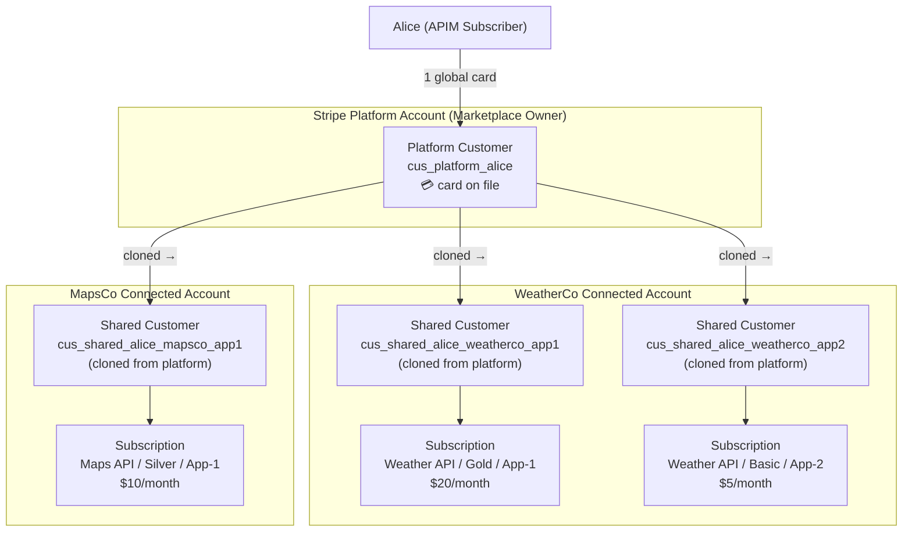

### 1.3 Default Subscription Flow

In the default implementation, when a user subscribes to a monetized API, the workflow executor performs all Stripe operations **synchronously** and **immediately** marks the subscription as `UNBLOCKED` (active).

The critical detail: the default implementation creates the platform customer using a **Stripe test token `tok_visa`** hardcoded in `StripeMonetizationConstants.DEFAULT_TOKEN`. This is a Stripe test card token intended for test environments — it does not collect any real payment information from the subscriber.

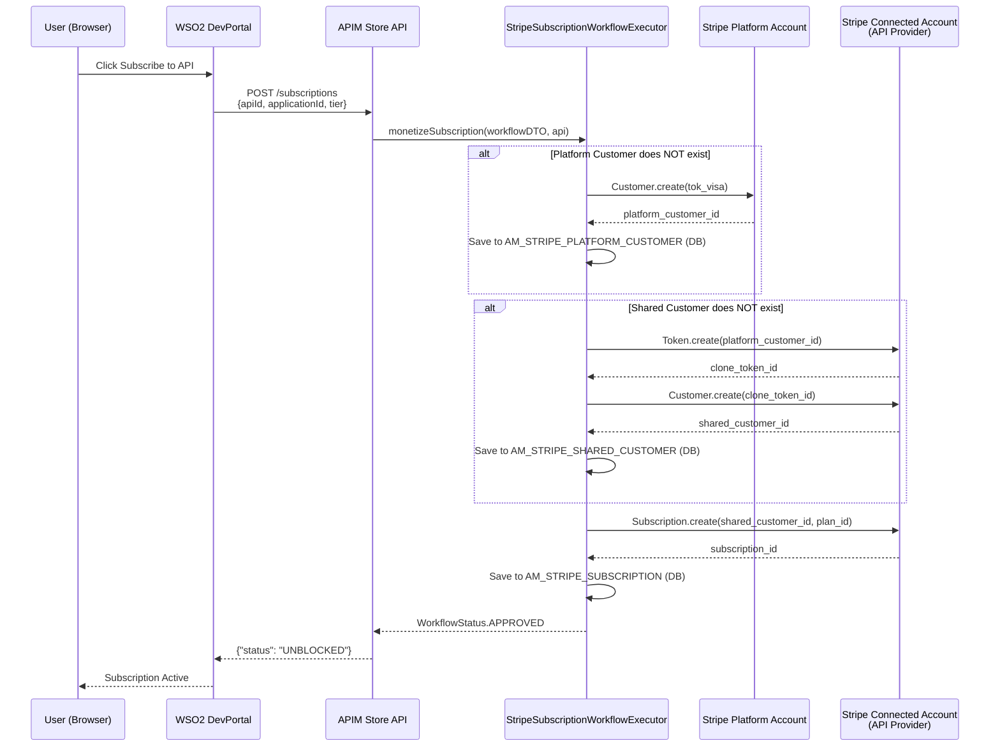

### 1.4 Limitations of the Default Implementation

| Limitation | Impact |
|---|---|
| **Uses `tok_visa` test token** | No real payment information is collected from the subscriber. Subscriptions are approved without any card on file. |
| **Synchronous — no user interaction** | The subscriber is never asked for their payment details. |
| **Not production-ready for billing** | Stripe subscriptions created this way cannot charge real customers. |
| **No redirect mechanism** | The workflow always returns `GeneralWorkflowResponse` which results in `status: UNBLOCKED` immediately — no way to pause the flow for external input. |
| **No payment failure handling** | If a card is declined or a recurring invoice fails, the APIM subscription remains active — API access is never blocked. |

---

## Part 2 — Custom Implementation: Stripe Checkout with Real Payment Collection

### 2.1 Goals

1. Collect **real payment methods** from new subscribers using Stripe's hosted Checkout page.
2. **Redirect** the subscriber's browser to Stripe Checkout during the subscription flow.
3. **Resume** the APIM subscription workflow automatically after the subscriber enters their card via **two parallel paths** — Stripe webhook and browser redirect — with a first-one-wins idempotency guard.
4. Support subscribers with **multiple applications** subscribing to APIs (reuse existing payment method without re-entry).
5. Show a **loading UI** to the user while the subscription is being activated after Stripe redirect.
6. **Handle payment failures** gracefully — Stripe retries automatically; APIM subscription remains `ON_HOLD` until payment clears.
7. **Enforce gateway access** — block/unblock API access in response to Stripe `invoice.payment_failed` and `customer.subscription.updated` events.
8. Provide a **Manage Billing** button in the DevPortal that opens the Stripe Customer Portal for invoice history and card management.

### 2.2 Solution Architecture

The full flow spans three phases. After the subscriber enters their card on Stripe, the workflow can be completed via **two independent paths**. The diagrams below show each path in isolation, followed by the combined view showing how both run in parallel with a first-one-wins guard.

---

#### 2.2.1 Path A — Browser-Redirect Completion Only

This path is triggered when the subscriber's browser is redirected back to DevPortal after card entry. `Subscriptions.jsx` detects the `?session_id=` query parameter and calls the `/complete-session` endpoint to activate the subscription.

> This diagram shows the full end-to-end flow assuming only the browser-redirect path is used (no webhook involvement).

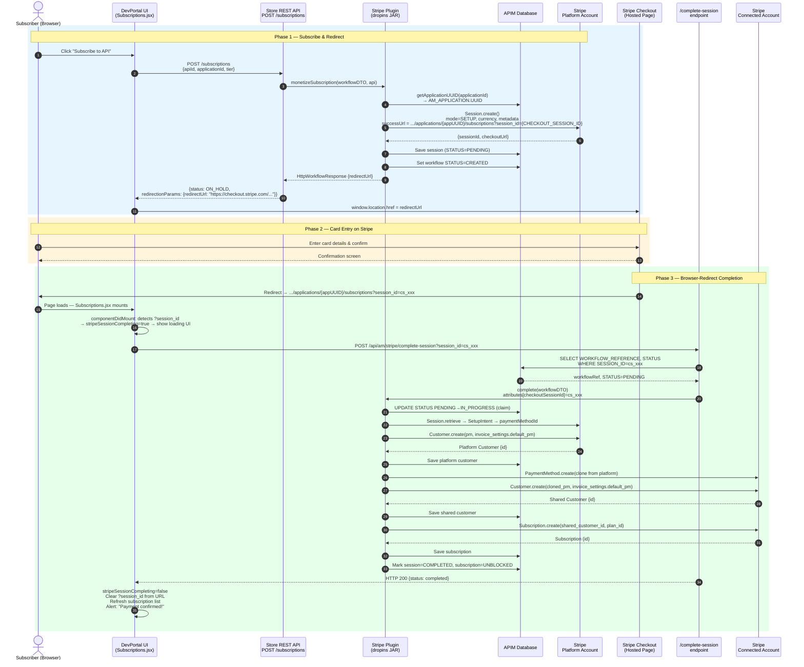

---

#### 2.2.2 Path B — Webhook Completion Only

This path is triggered when Stripe fires a `checkout.session.completed` event to the registered webhook endpoint. The webhook verifies the HMAC-SHA256 signature, looks up the workflow reference, and calls `WorkflowExecutor.complete()` to activate the subscription server-side — independent of the browser.

> This diagram shows the full end-to-end flow assuming only the webhook path is used (no browser-redirect involvement).

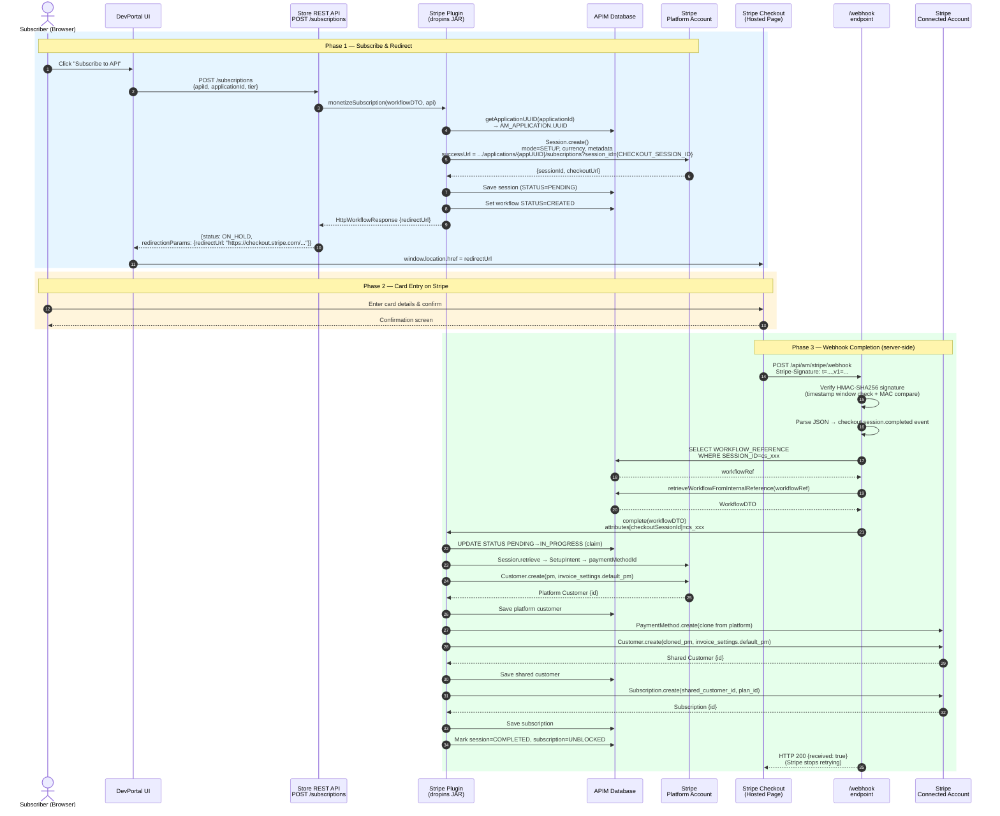

---

#### 2.2.3 Combined — Both Paths Running in Parallel (First-One-Wins)

In production, **both Phase 3 paths fire simultaneously** — Stripe delivers the webhook event at the same time the browser redirect lands. The first path to atomically claim the checkout session (`PENDING → IN_PROGRESS`) wins and performs all Stripe API work. The losing path detects `rowsAffected = 0` and skips Stripe work, proceeding only to update the APIM workflow database.

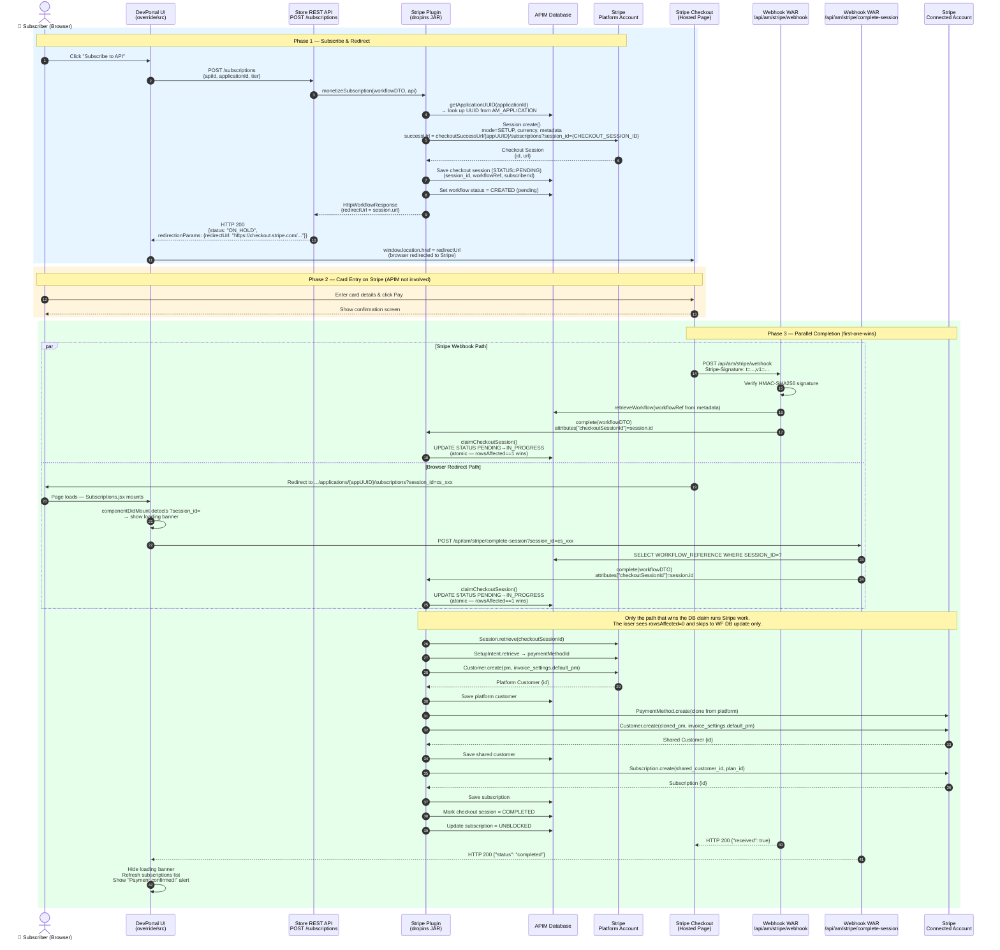

### 2.3 Component Changes

#### A. `StripeSubscriptionCreationWorkflowExecutor` (Plugin JAR)

Three decision points in `monetizeSubscription()`:

**Decision 1 — New Subscriber (no platform customer)**
Instead of creating a platform customer with `tok_visa`, the executor now:
1. Looks up the **application UUID** from `AM_APPLICATION` using `getApplicationUUID(applicationId)`.
2. Creates a **Stripe Checkout Session** in `SETUP` mode on the platform account.
3. Stores the session in `AM_STRIPE_CHECKOUT_SESSIONS` with `STATUS=PENDING`.
4. Sets workflow status to `CREATED` (pending).
5. Returns `HttpWorkflowResponse` with the Checkout Session URL.

**Decision 2 — Platform Customer exists, new Application (no shared customer)**
- Checks if the platform customer has a `default_payment_method` (set by Checkout).
- If **yes**: clones the PM to the connected account and creates a shared customer. No new Checkout needed.
- If **no** (legacy `tok_visa` path): falls back to the old `Token.create` approach.

**Decision 3 — Both customers exist**
Proceeds directly to creating the Stripe Subscription (same as default).

**Payment declined handling in `monetizeSubscription()`**

If `createMonetizedSubscriptions()` throws `STRIPE_PAYMENT_DECLINED` (initial invoice `incomplete`):
1. Cancel the orphaned incomplete Stripe subscription (so it does not show in the Customer Portal).
2. **Retry once** with the platform customer's current default PM on a fresh shared customer (handles stale shared customer entries from prior failed attempts).
3. If the retry succeeds: return `execute(workflowDTO)` — subscription activates, no Checkout needed.
4. If the retry also fails: cancel the retry orphan, fall back to a new Stripe Checkout Session.

**Idempotency guard in `complete()`**

Both the webhook path and the browser-redirect path call `WorkflowExecutor.complete()` concurrently. Before running Stripe API calls, `complete()` atomically claims the checkout session:

```sql
UPDATE AM_STRIPE_CHECKOUT_SESSIONS SET STATUS = 'IN_PROGRESS'
WHERE SESSION_ID = ? AND STATUS = 'PENDING'
```

- `rowsAffected == 1` → this path wins; proceed with Stripe work.
- `rowsAffected == 0` → another path already claimed it; skip Stripe work, proceed to APIM workflow DB update only.
- If Stripe work throws a **non-payment** error, the claim is reset (`IN_PROGRESS → PENDING`) so the other path can retry.
- If Stripe work throws `STRIPE_PAYMENT_DECLINED`, the session is marked `COMPLETED` (not reset) — Fix 3 handles activation when Stripe retries and collects payment.

#### B. DevPortal UI Override (`override/src/app/components/`)

**Stripe redirect on `ON_HOLD`** (`SubscriptionTableData.jsx`):
When a subscription row shows `ON_HOLD`, the "Resume" button calls `GET /checkout-url` then:
1. Tries `/complete-session` first (handles already-paid but stuck cases).
2. On HTTP 200 → refresh.
3. On HTTP 402 → show alert: "Your initial payment was declined. Stripe will retry automatically. You can also delete this subscription and re-subscribe with a different card."
4. On other error or no session → redirect to `checkoutUrl`.

**Browser-redirect completion** (`Subscriptions.jsx`):
After Stripe, the user lands on `.../applications/{appUUID}/subscriptions?session_id=cs_xxx`. On `componentDidMount`:
1. Detects `session_id` query parameter.
2. Sets state `stripeSessionCompleting: true` → shows loading UI.
3. Calls `POST /api/am/stripe/complete-session?session_id=cs_xxx`.
4. On success: clears `session_id` from URL, refreshes subscription list, shows "Payment confirmed!" alert.
5. On HTTP 402 (payment declined): shows payment-declined alert with retry guidance.

**Manage Billing button** (`SubscriptionTableData.jsx`):
When a subscription is `UNBLOCKED` on a monetized API, a "Manage Billing" button appears. Clicking it calls `GET /api/am/stripe/billing-portal?applicationId={appUUID}` and opens the returned Stripe Customer Portal URL in a new tab.

#### C. Stripe Webhook WAR (`api#am#stripe.war`)

A standalone Java web application deployed at `/api/am/stripe/` on the Carbon server. It exposes five endpoints:

| Endpoint | Method | Purpose |
|---|---|---|
| `/api/am/stripe/webhook` | `POST` | Receives Stripe events (HMAC-SHA256 verified) |
| `/api/am/stripe/checkout-url` | `GET` | Returns checkout URL + session ID for an ON_HOLD subscription |
| `/api/am/stripe/complete-session` | `POST` | Browser-redirect completion — called by DevPortal UI |
| `/api/am/stripe/billing-portal` | `GET` | Opens Stripe Customer Portal for a given application UUID |

Key design decisions:
- **No stripe-java dependency** — HMAC-SHA256 verification is implemented natively with `javax.crypto.Mac` to avoid Gson classloader conflicts with the Carbon OSGi runtime.
- **Jackson for JSON parsing** — eliminates the Gson dependency entirely.
- **Delegates workflow completion to the plugin** — the WAR calls `WorkflowExecutorFactory.getWorkflowExecutor().complete()`. Stripe customer/subscription creation runs inside the plugin OSGi bundle.

### 2.4 Full End-to-End Flow (Phase 3 detail)

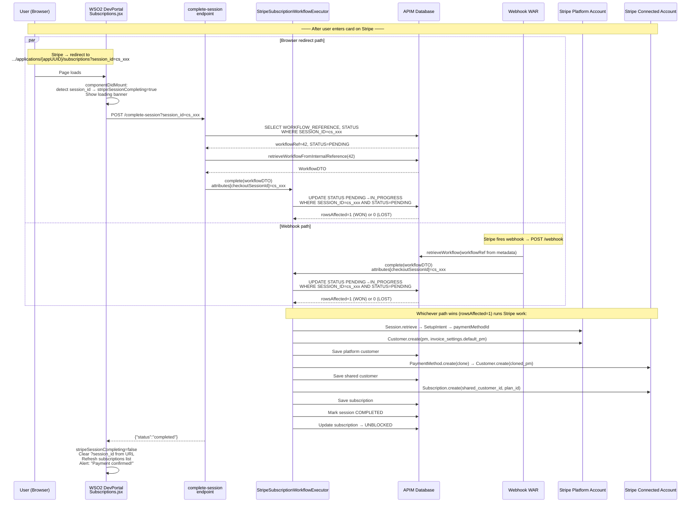

### 2.5 Second Application Subscription Flow (Returning Subscriber)

When a subscriber who already went through Checkout creates a **second application** and subscribes to an API, the flow is shorter — no new Checkout is needed:

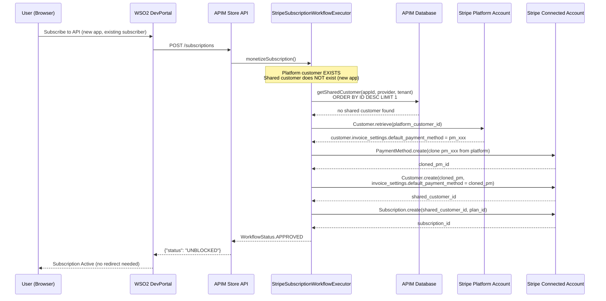

**If the initial charge fails (e.g. stale shared customer from a prior failed attempt):**

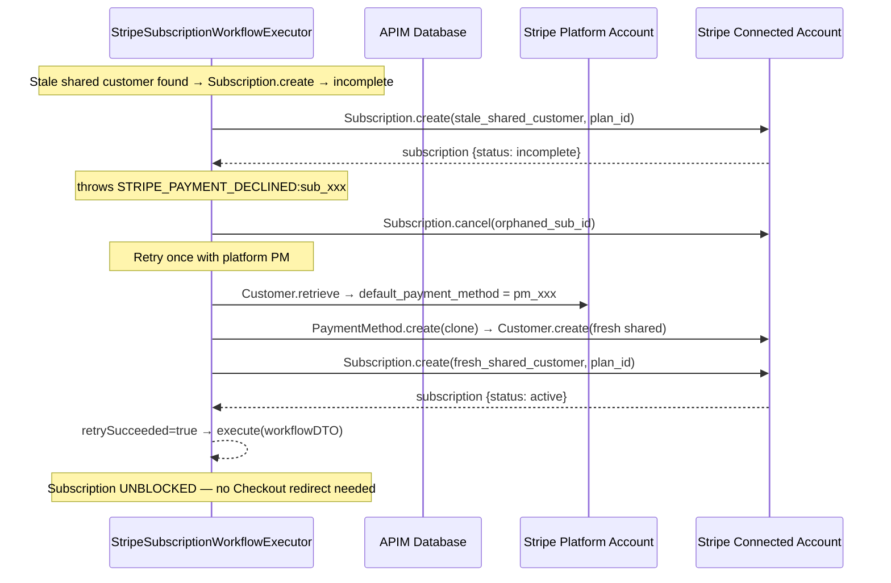

### 2.6 Payment Failure Handling (STRIPE_PAYMENT_DECLINED flow)

When a card is accepted by Stripe but the initial subscription invoice payment fails, Stripe sets the subscription status to `incomplete`. The custom implementation handles this through two sub-paths.

#### 2.6.1 Payment Failed via Checkout Path (`completeStripeCheckoutSubscription`)

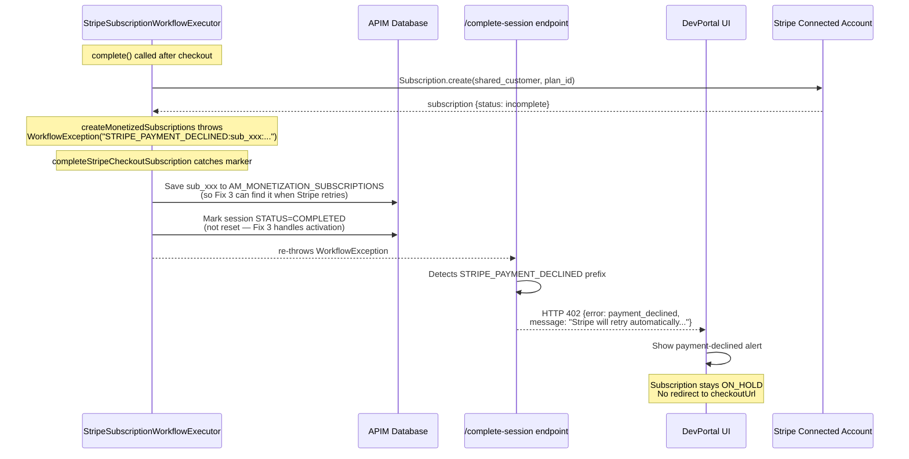

#### 2.6.2 Payment Failed via Direct Path (`monetizeSubscription`)

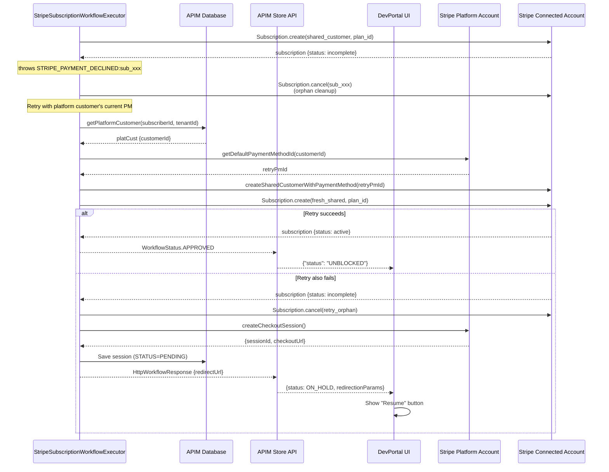

### 2.7 Gateway Enforcement — Invoice Payment Failed + Recovery (Fix 2 + Fix 3)

After a subscription is activated, Stripe sends periodic invoices for recurring charges. If a recurring payment fails, the custom webhook handler blocks API access. When Stripe automatically retries and collects payment, API access is unblocked.

#### Registered Stripe Webhook Events

| Event | Handler | Action |
|---|---|---|
| `checkout.session.completed` | `WebhookApiServiceImpl` | Activate new subscription (Fix 1) |
| `invoice.payment_failed` | `WebhookApiServiceImpl` | Block API access (Fix 2) |
| `customer.subscription.updated` | `WebhookApiServiceImpl` | Unblock API access when subscription becomes active (Fix 3) |

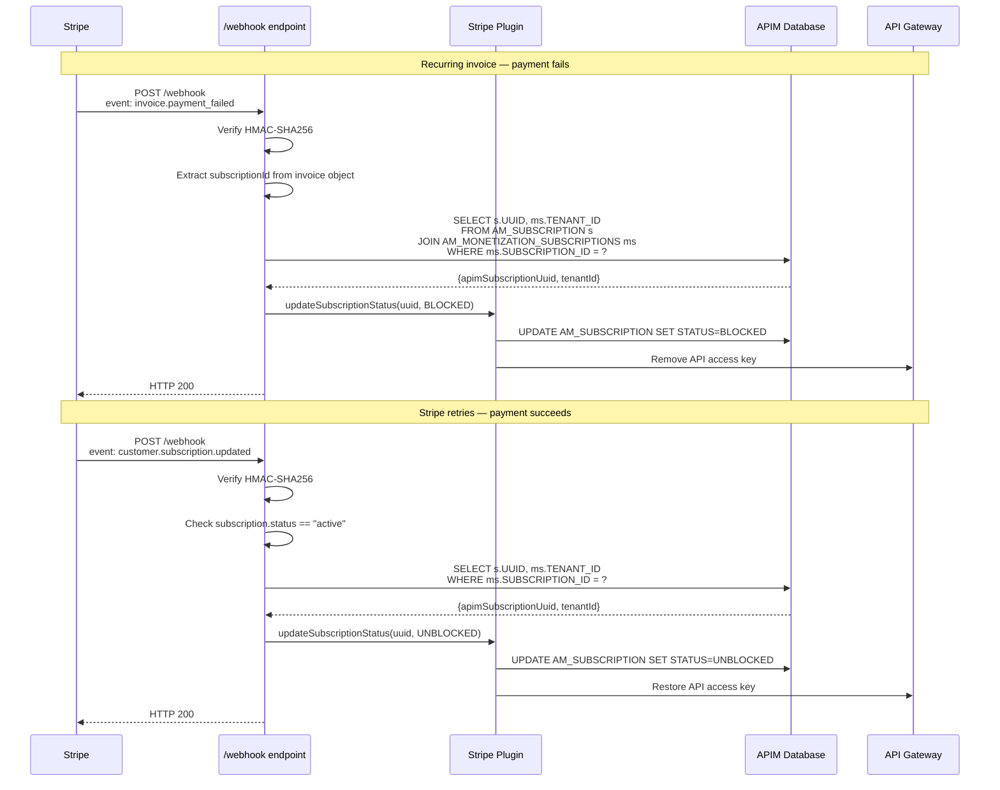

**Key SQL used for both Fix 2 and Fix 3:**

```sql
SELECT s.UUID, ms.TENANT_ID
FROM AM_SUBSCRIPTION s
JOIN AM_MONETIZATION_SUBSCRIPTIONS ms
  ON ms.SUBSCRIBED_API_ID = s.API_ID
  AND ms.SUBSCRIBED_APPLICATION_ID = s.APPLICATION_ID
WHERE ms.SUBSCRIPTION_ID = ?
```

This resolves a Stripe subscription ID to the APIM subscription UUID and tenant ID needed to block or unblock access.

### 2.8 Billing Portal (Manage Billing)

The DevPortal shows a **"Manage Billing"** button on each active monetized subscription row. Clicking it opens the Stripe Customer Portal in a new tab, allowing the subscriber to view invoice history, download invoices, and update their payment method.

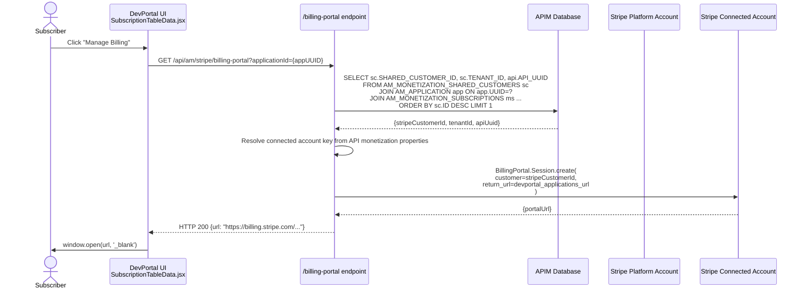

**Important detail:** The billing portal is opened for the **shared customer** on the **connected account** (not the platform customer), because subscriptions and invoices live on the connected account. `ORDER BY sc.ID DESC LIMIT 1` ensures the latest valid shared customer is used when multiple entries exist (e.g. from prior failed attempts).

### 2.9 Subscription Deletion Behavior

When a subscriber deletes an `ON_HOLD` or `UNBLOCKED` subscription from the DevPortal:

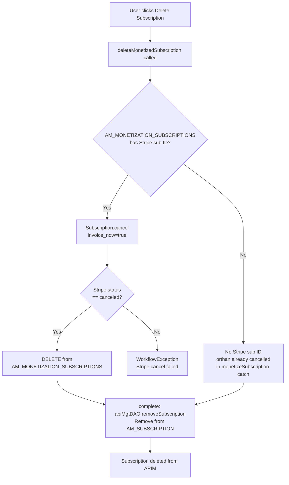

**What is cleaned up:**

| Table | Cleaned on delete? | Notes |
|---|---|---|
| `AM_SUBSCRIPTION` | Yes | Via `apiMgtDAO.removeSubscription()` in `complete()` |
| `AM_MONETIZATION_SUBSCRIPTIONS` | Yes (if row existed) | Via `removeMonetizedSubscription()` |
| `AM_STRIPE_CHECKOUT_SESSIONS` | **No** | PENDING row remains — benign; the workflow is gone so `/complete-session` returns `already_completed` |
| `AM_MONETIZATION_SHARED_CUSTOMERS` | **No** | Intentional — reused for future subscriptions from the same app |
| `AM_MONETIZATION_PLATFORM_CUSTOMERS` | **No** | Intentional — one global entry per subscriber |

**Case A — Subscription ID in DB** (payment failed during checkout path — we save it for Fix 3): Stripe cancellation is called with `invoice_now=true`. The `incomplete` subscription is cancelled in Stripe, voiding the pending invoice.

**Case B — No subscription ID in DB** (payment failed during direct path — orphan was cancelled inline in `monetizeSubscription`): Deletion skips the Stripe API call. The orphaned Stripe subscription was already cancelled when `monetizeSubscription` caught the `STRIPE_PAYMENT_DECLINED` exception.

### 2.10 Platform Customer Idempotency

`createPlatformCustomerWithPaymentMethod()` is idempotent against race conditions and retries:

1. **DB lookup first**: checks `AM_MONETIZATION_PLATFORM_CUSTOMERS` before creating anything in Stripe.
2. **Stripe-level recovery**: if Stripe throws `InvalidRequestException: payment method already been attached to a customer`, the code calls `PaymentMethod.retrieve(paymentMethodId)` to find the existing customer, then saves it to the DB and returns it.

This prevents duplicate platform customers when the same subscriber subscribes twice simultaneously or when a previous attempt failed after the Stripe call but before the DB write.

### 2.11 Stripe Webhook WAR — Signature Verification Detail

Stripe signs every webhook delivery with HMAC-SHA256. The verification logic (implemented natively, no stripe-java) works as follows:

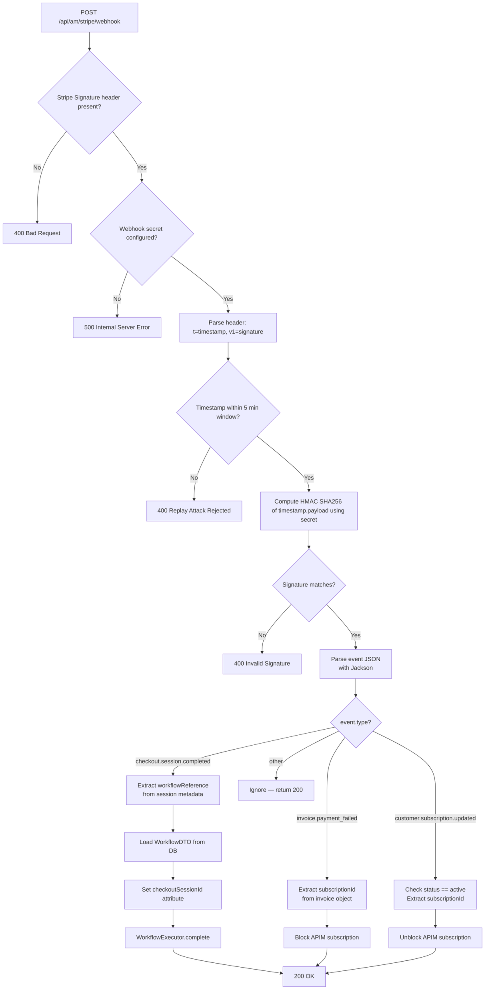

### 2.12 Database Tables Used

| Table | Purpose |
|---|---|
| `AM_WORKFLOWS` | Stores workflow state (CREATED → APPROVED). Primary key for resumption. |
| `AM_MONETIZATION_PLATFORM_CUSTOMERS` | Maps APIM subscriber ID to Stripe platform customer ID |
| `AM_MONETIZATION_SHARED_CUSTOMERS` | Maps (application, API provider, tenant) to Stripe connected-account customer ID |
| `AM_MONETIZATION_SUBSCRIPTIONS` | Maps APIM subscription to Stripe subscription ID |
| `AM_STRIPE_CHECKOUT_SESSIONS` | Stores active checkout sessions: session ID, workflow reference, subscriber, status |

#### `AM_STRIPE_CHECKOUT_SESSIONS` — Status Values

| Status | Meaning |
|---|---|
| `PENDING` | Session created, waiting for subscriber to complete card entry on Stripe |
| `IN_PROGRESS` | Atomically claimed by one completion path (webhook or browser-redirect) — Stripe work is running |
| `COMPLETED` | Subscription successfully activated (or payment declined — Fix 3 handles subsequent activation) |
| `EXPIRED` | Session expired before the subscriber entered a card |

#### Key SQL Patterns

**Get latest shared customer** (used in `monetizeSubscription` and `getSharedCustomer`):
```sql
SELECT ID, SHARED_CUSTOMER_ID
FROM AM_MONETIZATION_SHARED_CUSTOMERS
WHERE APPLICATION_ID=? AND API_PROVIDER=? AND TENANT_ID=?
ORDER BY ID DESC LIMIT 1
```
`ORDER BY ID DESC LIMIT 1` ensures the most recently created shared customer is returned, preventing stale entries from prior failed attempts from being picked up.

**Get shared customer for billing portal** (used in `BillingPortalApiServiceImpl`):
```sql
SELECT sc.SHARED_CUSTOMER_ID AS STRIPE_CUSTOMER_ID, sc.TENANT_ID, api.API_UUID
FROM AM_MONETIZATION_SHARED_CUSTOMERS sc
JOIN AM_APPLICATION app ON app.APPLICATION_ID = sc.APPLICATION_ID
JOIN AM_MONETIZATION_SUBSCRIPTIONS ms
  ON ms.SUBSCRIBED_APPLICATION_ID = sc.APPLICATION_ID
  AND ms.SHARED_CUSTOMER_ID = sc.ID
JOIN AM_API api ON api.API_ID = ms.SUBSCRIBED_API_ID
WHERE app.UUID = ?
ORDER BY sc.ID DESC LIMIT 1
```

### 2.13 Configuration

**`workflow-extensions.xml`** — set `checkoutSuccessUrl` to the **base applications URL** (the plugin appends `/{applicationUUID}/subscriptions` automatically):

```xml
<SubscriptionCreation executor="org.wso2.apim.monetization.impl.workflow.StripeSubscriptionCreationWorkflowExecutor">
    <Property name="checkoutSuccessUrl">https://&lt;devportal-host&gt;:9443/devportal/applications</Property>
    <Property name="checkoutCancelUrl">https://&lt;devportal-host&gt;:9443/devportal/applications</Property>
</SubscriptionCreation>
```

At runtime, Stripe is configured with a success URL of:
```
https://<devportal-host>:9443/devportal/applications/{applicationUUID}/subscriptions?session_id={CHECKOUT_SESSION_ID}
```

> **Important:** Do NOT add `/subscriptions` to `checkoutSuccessUrl` — the plugin appends it dynamically using the application UUID. Using the integer application ID causes a "Page Not Found" error because DevPortal routes use UUIDs.

**`api-manager.xml`** — webhook signing secret:
```xml
<Monetization>
    <StripeWebhookSecret>whsec_your_signing_secret_here</StripeWebhookSecret>
</Monetization>
```

**Stripe Dashboard** — webhook endpoint registration:
- Endpoint URL: `https://<apim-host>:9443/api/am/stripe/webhook`
- Events to register:
  - `checkout.session.completed`
  - `invoice.payment_failed`
  - `customer.subscription.updated`

---

## Part 3 — Issues Resolved During Development

| # | Issue | Root Cause | Fix |
|---|---|---|---|
| 1 | `Missing required param: currency` | stripe-java 24.x requires `currency` on Checkout Session for setup mode | Retrieve the Stripe Plan for the tier before creating the session; pass the plan's currency to `SessionCreateParams.setCurrency()` |
| 2 | `redirectionParams: null` in subscription response | `StripeSubscriptionCreationWorkflowExecutor` returned `GeneralWorkflowResponse` — APIM only populates `redirectionParams` when the response is `instanceof HttpWorkflowResponse` | Changed return type to `HttpWorkflowResponse` with `setRedirectUrl(checkoutSession.getUrl())` |
| 3 | UI redirect not working (`/checkout-url` returned 404) | DevPortal override files called `GET /api/am/stripe/checkout-url?subscriptionId={UUID}` but the DB stores a numeric workflow reference, not a UUID — query returned 0 rows | Removed the `/checkout-url` call; read `redirectionParams` directly from the subscription POST response |
| 4 | Webhook `NoSuchMethodError: GsonBuilder.addReflectionAccessFilter` | `stripe-java 24.x` calls Gson 2.10+ API, but the Carbon OSGi classloader exposes an older Gson that shadows the WAR's bundled copy | Removed stripe-java from the webhook WAR entirely; implemented HMAC-SHA256 verification natively with `javax.crypto.Mac` and parsed event JSON with Jackson |
| 5 | `No attached payment method` on Subscription.create | `createSharedCustomerWithPaymentMethod` attached the PM but did not set `invoice_settings.default_payment_method` — Stripe requires this for subscription billing | Added `invoice_settings.default_payment_method = clonedPm.getId()` to the shared customer creation params |
| 6 | Second-application subscription fails — `Token.create: customer must have an active payment source` | The legacy `createSharedCustomer` uses `Token.create` which requires a Stripe source. Checkout-created customers have a `payment_method` — incompatible with the Token API | Added `getDefaultPaymentMethodId()` helper: if platform customer has a default PM, use `createSharedCustomerWithPaymentMethod`; otherwise fall back to legacy `createSharedCustomer` |
| 7 | No loading UI or success alert after Stripe redirect | `checkoutSuccessUrl` pointed to `/devportal/applications` — `Subscriptions.jsx` never mounted so `session_id` was never detected | Added browser-redirect completion path to `Subscriptions.jsx` (`componentDidMount` detects `?session_id=`) and `POST /api/am/stripe/complete-session` endpoint |
| 8 | "Page Not Found" after Stripe redirect | Success URL used `subWorkFlowDTO.getApplicationId()` (integer `57`) but DevPortal routes use the application UUID | Added `getApplicationUUID(int applicationId)` which queries `AM_APPLICATION.UUID`; success URL now uses the UUID |
| 9 | Incomplete subscription shown as "You're all done here" | `createMonetizedSubscriptions` returned normally for `incomplete` subscriptions; `completeStripeCheckoutSubscription` marked session `COMPLETED` and the browser-redirect path fell back to the already-consumed Stripe Checkout URL | Changed `createMonetizedSubscriptions` to throw `WorkflowException("STRIPE_PAYMENT_DECLINED:sub_xxx:...")` for incomplete subscriptions; `CompleteSessionApiServiceImpl` returns HTTP 402; DevPortal shows a payment-declined alert instead of redirecting |
| 10 | `InvalidRequestException: payment method already been attached` on re-subscribe | `createPlatformCustomerWithPaymentMethod` called unconditionally without checking if a platform customer already existed in DB | Made idempotent: check DB first via `getPlatformCustomer()`; on "already attached" error recover via `PaymentMethod.retrieve()` to find the existing customer |
| 11 | `STRIPE_PAYMENT_DECLINED` on re-subscribe (different app, card already on file) | `getSharedCustomer` returned a stale shared customer from a prior failed attempt (SQL had no `ORDER BY` / `LIMIT`); subscription immediately went `incomplete` | Added `ORDER BY ID DESC LIMIT 1` to `GET_BE_SHARED_CUSTOMER_SQL`; added retry logic in `monetizeSubscription` catch block — tries fresh shared customer with platform PM before falling back to Checkout |
| 12 | Billing portal showing old card and outstanding invoice | `GET_SHARED_CUSTOMER_AND_API_BY_APP_UUID_SQL` had no `ORDER BY` — returned the oldest shared customer (which had the failed card); orphaned incomplete subscription still existed in Stripe | Added `ORDER BY sc.ID DESC` to billing portal SQL; cancel orphaned incomplete subscription in `monetizeSubscription` catch block before Checkout fallback |
| 13 | Recurring payment failure does not block API access | Default implementation had no webhook handlers for `invoice.payment_failed` — subscribers retained full API access even after payment failure | Added Fix 2: `invoice.payment_failed` handler calls `updateSubscriptionStatus(BLOCKED)` using Stripe subscription ID to locate APIM subscription |
| 14 | Subscription not re-activated after Stripe payment retry succeeds | No handler for `customer.subscription.updated` — when Stripe auto-retried and collected payment, APIM subscription remained `BLOCKED` | Added Fix 3: `customer.subscription.updated` handler checks `subscription.status == active` and calls `updateSubscriptionStatus(UNBLOCKED)` |

---

## Part 4 — Deployment Checklist

```
[ ] Build the plugin JAR:
      cd stripe-plugin && mvn clean package
      Copy target/org.wso2.apim.monetization.impl-*.jar
          → <APIM_HOME>/repository/components/lib/
      NOTE: dropins/ is NOT needed — lib/ is sufficient and avoids classloader issues

[ ] Build the webhook WAR:
      cd stripe-webhook && mvn clean package
      Delete the extracted dir first (if server was running):
          rm -rf <APIM_HOME>/repository/deployment/server/webapps/api#am#stripe/
      Copy target/api#am#stripe.war
          → <APIM_HOME>/repository/deployment/server/webapps/

[ ] DevPortal UI overrides — place in override/src/ (no rebuild required at runtime):
      <APIM_HOME>/repository/deployment/server/webapps/devportal/
        override/src/app/components/Applications/Details/Subscriptions.jsx
        override/src/app/components/Applications/Details/SubscriptionTableData.jsx
        override/src/app/components/Apis/Details/Credentials/Credentials.jsx

[ ] Configure workflow-extensions.xml:
      checkoutSuccessUrl = https://<devportal-host>:9443/devportal/applications
      checkoutCancelUrl  = https://<devportal-host>:9443/devportal/applications
      NOTE: Do NOT append /subscriptions — the plugin adds /{appUUID}/subscriptions

[ ] Configure api-manager.xml:
      Add <StripeWebhookSecret>whsec_...</StripeWebhookSecret> under <Monetization>

[ ] Register webhook endpoint in Stripe Dashboard:
      URL: https://<host>:9443/api/am/stripe/webhook
      Events:
        - checkout.session.completed
        - invoice.payment_failed
        - customer.subscription.updated

[ ] Restart WSO2 APIM
```

### Stripe Test Cards

| Card Number | Scenario |
|---|---|
| `4242 4242 4242 4242` | Payment succeeds immediately |
| `4000 0000 0000 0341` | Card attaches successfully but all charges are declined — triggers `STRIPE_PAYMENT_DECLINED` path |
| `4000 0025 0000 3151` | Requires 3D Secure authentication — subscription becomes `incomplete` |
| `4000 0000 0000 9995` | Card always declined (insufficient funds) |

Use any future expiry date (e.g. `12/34`) and any 3-digit CVC (e.g. `123`).
