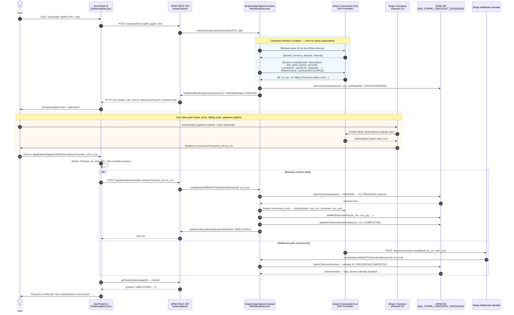
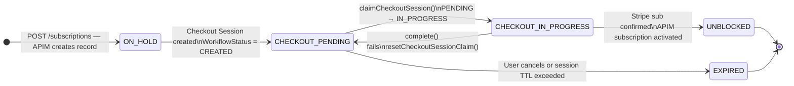

# Per-Subscription Stripe Checkout — Design Document

**Branch:** `feature/per-subscription-checkout`
**Status:** Design approved — awaiting implementation
**Base branch:** `main`

---

## 1. Problem Statement

In the current implementation, the Stripe-hosted Checkout page is shown **only once** per subscriber: the first time they attempt to subscribe to any monetized API, when no Stripe Platform Customer record exists. All subsequent subscriptions silently reuse the payment method captured during that first checkout without any user interaction or confirmation.

This behaviour is problematic for the following reasons:

| # | Issue |
|---|-------|
| 1 | Users are charged for new API subscriptions without seeing what they are paying for or how much |
| 2 | Users cannot select a different payment method per subscription |
| 3 | The checkout page is shown in **setup mode** (card capture only), not **subscription mode**, so no pricing is presented even on the first subscription |
| 4 | Payment failures on subsequent subscriptions result in an opaque fallback to a new checkout rather than a clear UX prompt |
| 5 | The legacy `tok_visa` / `Token.create()` path is still active for subscribers whose first checkout pre-dates this implementation |

---

## 2. Goals

1. **Every** new API subscription by **any** subscriber must pass through a Stripe-hosted Checkout page.
2. The Checkout page must present the plan name, price, billing cycle, and available payment methods.
3. The user must explicitly enter or confirm their payment method and complete the transaction before the APIM subscription is activated.
4. The flow must remain idempotent — duplicate webhook deliveries and double browser-redirect calls must not create duplicate subscriptions.
5. Existing subscriptions and customers must not be disrupted.

---

## 3. Current Architecture (as-is)

### 3.1 Stripe Connect Customer Hierarchy

```
Stripe Platform Account  (tenant BillingEnginePlatformAccountKey)
  └── Platform Customer  (one per APIM subscriber, in AM_MONETIZATION_PLATFORM_CUSTOMERS)
        └── Shared Customer  (one per Application × API Provider, in AM_MONETIZATION_SHARED_CUSTOMERS)
              └── Stripe Subscription  (in AM_MONETIZATION_SUBSCRIPTIONS)
```

### 3.2 Decision Tree in `monetizeSubscription()` — Current

```
monetizeSubscription()
  │
  ├─ Shared Customer exists for (appId, apiProvider, tenantId)?
  │    YES ──────────────────────────────────────────────► SUBSCRIPTION_CREATE
  │
  └─ NO
       │
       ├─ Platform Customer exists for (subscriberId, tenantId)?
       │    NO ──► Stripe Checkout (SETUP mode) ──► PENDING workflow ──► return redirectUrl
       │
       └─ YES
             └─► create Shared Customer (silently) ──► SUBSCRIPTION_CREATE

SUBSCRIPTION_CREATE
  └─ Stripe Subscription.create()
       ├─ status=active  ──► addBESubscription() ──► APIM UNBLOCKED
       └─ status=incomplete (STRIPE_PAYMENT_DECLINED)
             └─► retry with fresh PM ──► if fails ──► Checkout (fallback)
```

### 3.3 Key Problems

- Checkout is conditional (`if platform customer == null`), not universal.
- Checkout uses `SETUP` mode — collects a payment method but does **not** present pricing.
- Server-side `Subscription.create()` is called without user visibility after setup.
- The platform customer → shared customer token-cloning path (`Token.create`) is legacy and fails with Payment Methods API customers.

---

## 4. Proposed Architecture (to-be)

### 4.1 Core Change

Remove the conditional branching entirely. **Always** create a Stripe Checkout Session in `subscription` mode targeting the connected account. Let Stripe handle subscription creation. The backend only needs to record the Stripe-created subscription ID in the APIM DB and unblock the workflow.

### 4.2 New Decision Tree

```
monetizeSubscription()
  └─► Always: create Stripe Checkout Session (SUBSCRIPTION mode, connected account)
        └─► save session to AM_STRIPE_CHECKOUT_SESSIONS (STATUS=PENDING)
        └─► WorkflowStatus = CREATED
        └─► return HttpWorkflowResponse(redirectUrl)
              │
              └─► User completes checkout on Stripe
                    │
                    ├─► Webhook: checkout.session.completed
                    │     └─► complete() ──► record sub ──► APIM UNBLOCKED
                    │
                    └─► Browser redirect: ?session_id=cs_xxx
                          └─► complete() ──► (idempotent — only one path succeeds)
```

### 4.3 Checkout Session Parameters

| Parameter | Value |
|-----------|-------|
| `mode` | `subscription` |
| `line_items[0].price` | Stripe price ID for the selected tier (from `AM_MONETIZATION`) |
| `line_items[0].quantity` | `1` |
| `success_url` | `{checkoutSuccessUrl}/{appUUID}/subscriptions?session_id={CHECKOUT_SESSION_ID}` |
| `cancel_url` | `{checkoutCancelUrl}` |
| `customer_email` | subscriber email (pre-fill) |
| `metadata` | `workflowReference`, `subscriberId`, `tenantId`, `apiUuid`, `applicationId`, `tierName`, `apiProvider`, `applicationName`, `apiName`, `apiVersion` |
| Session target | **Connected account** (`RequestOptions.setStripeAccount(connectedAccountKey)`) |

### 4.4 Completion Path

After checkout the `complete()` method is called by either the webhook handler or the browser-redirect path (first-one-wins via `claimCheckoutSession()`).

Instead of creating platform/shared customers and calling `Subscription.create()`, it now:

1. Retrieves the Checkout Session: `Session.retrieve(sessionId, requestOptions)`
2. Reads `session.getSubscription()` — the Stripe subscription ID created by Stripe during checkout
3. Reads `session.getCustomer()` — the customer Stripe created or reused on the connected account
4. Calls `stripeMonetizationDAO.addBESubscription(...)` to record the mapping
5. Marks the session `COMPLETED`
6. Updates APIM subscription status to `UNBLOCKED`

---

## 5. End-to-End Sequence Diagram



---

## 6. Subscription & Session State Transitions



---

## 7. Component Changes Required

### 7.1 `StripeSubscriptionCreationWorkflowExecutor.java` — Primary Changes

#### `monetizeSubscription(WorkflowDTO, API)` and `monetizeSubscription(WorkflowDTO, APIProduct)`

**Remove:**
- The entire `if (monetizationSharedCustomer.getSharedCustomerId() == null)` block and all nested conditionals
- The `STRIPE_PAYMENT_DECLINED` retry loop (no longer applicable — Stripe handles payment at checkout)
- All calls to `createSharedCustomer()`, `createSharedCustomerWithPaymentMethod()`, `createMonetizationPlatformCutomer()`

**Add:**
- Direct call to `createCheckoutSession()` for every invocation
- Session persistence via `stripeMonetizationDAO.saveCheckoutSession()`
- Set `WorkflowStatus.CREATED` and return `HttpWorkflowResponse(checkoutSession.getUrl())`

#### `createCheckoutSession()`

**Change:**
- `SessionCreateParams.Mode.SETUP` → `SessionCreateParams.Mode.SUBSCRIPTION`
- Add `addLineItem(SessionCreateParams.LineItem.builder().setPrice(priceId).setQuantity(1L).build())`
- Move session creation to the **connected account**: pass `requestOptions` (with `setStripeAccount`) to `Session.create()`
- Remove `setCurrency()` — not needed in subscription mode (currency is on the price)

#### `completeStripeCheckoutSubscription()`

**Replace** SetupIntent retrieval and customer creation steps with:
1. `Session.retrieve(sessionId, requestOptions)` on the connected account
2. `String stripeSubId = session.getSubscription()`
3. `String stripeCustomerId = session.getCustomer()`
4. `stripeMonetizationDAO.addBESubscription(identifier, applicationId, tenantId, 0, stripeSubId, apiUuid)` — `sharedCustomerId` FK becomes the connected account customer
5. `stripeMonetizationDAO.updateCheckoutSessionStatus(sessionId, COMPLETED)`

#### Methods to remove (after migration)

| Method | Reason |
|--------|--------|
| `createPlatformCustomerWithPaymentMethod()` | Checkout creates customer on connected account directly |
| `createSharedCustomerWithPaymentMethod()` | No longer needed |
| `createSharedCustomer()` | Legacy `Token.create()` — incompatible with Payment Methods API |
| `createMonetizationPlatformCutomer()` | Uses `DEFAULT_TOKEN = "tok_visa"` — test-only, must not exist in production |
| `extractStripeSubId()` | `STRIPE_PAYMENT_DECLINED` pattern no longer thrown |
| `getDefaultPaymentMethodId()` | Only used by the silent-reuse path |

### 7.2 `StripeMonetizationDAO.java` — No schema changes required

The `AM_STRIPE_CHECKOUT_SESSIONS` table and all related methods already support the new flow. The `addBESubscription()` method accepts `sharedCustomerId` as an integer FK into `AM_MONETIZATION_SHARED_CUSTOMERS`. In the new flow this FK relationship changes — see section 8.

### 7.3 `StripeMonetizationConstants.java`

- Remove `DEFAULT_TOKEN = "tok_visa"` once legacy code is removed.

### 7.4 `Subscriptions.jsx` (DevPortal UI)

**No changes required.** The existing `ON_HOLD` + `redirectUrl` handling and `handleStripeSessionCompletion()` already implement the correct browser-redirect completion path.

### 7.5 `StripeBillingPortalService.java`

Requires review: the shared customer concept changes. The billing portal must target the customer on the connected account — this is the checkout-created customer. The existing `getSharedCustomerAndApiByApplicationUUID()` query may need updating depending on whether `AM_MONETIZATION_SHARED_CUSTOMERS` is still populated by the new flow.

---

## 8. Database Considerations

### 8.1 `AM_MONETIZATION_SHARED_CUSTOMERS` — Usage Changes

In the current flow this table is populated by `createSharedCustomer()` / `createSharedCustomerWithPaymentMethod()`. In the new flow, Stripe creates the customer on the connected account directly during checkout. The table can be updated in `completeStripeCheckoutSubscription()` to record the checkout-created connected account customer ID so the rest of the system (billing portal, deletion workflow) continues to work.

### 8.2 `AM_MONETIZATION_PLATFORM_CUSTOMERS` — Deprecated on the new path

No new records will be written on the new checkout path. Existing records are preserved for backwards compatibility with already-active subscriptions.

### 8.3 `AM_STRIPE_CHECKOUT_SESSIONS` — No changes

The schema introduced for the `feature/redirect-based-completion` branch is sufficient.

---

## 9. Backwards Compatibility

| Scenario | Behaviour |
|----------|-----------|
| Existing active subscriptions (created before this feature) | Unaffected — deletion and billing portal flows read existing DB records |
| Subscriber with existing platform customer attempts new subscription | New checkout session is created; outcome is stored as a new shared customer record and subscription record |
| Webhook `customer.subscription.updated` / `invoice.payment_failed` handlers | Unchanged — they operate on existing `AM_MONETIZATION_SUBSCRIPTIONS` records by Stripe subscription ID |

---

## 10. Configuration Changes

No new configuration properties are required. The existing `checkoutSuccessUrl` and `checkoutCancelUrl` properties in `workflow-extensions.xml` are reused.

```xml
<!-- workflow-extensions.xml — existing properties, no change needed -->
<WorkflowExecutor name="StripeSubscriptionCreationWorkflowExecutor">
    <Property name="checkoutSuccessUrl">https://devportal.example.com/devportal/applications</Property>
    <Property name="checkoutCancelUrl">https://devportal.example.com/devportal/applications</Property>
</WorkflowExecutor>
```

---

## 11. Out of Scope

- Tier upgrade/downgrade flow (handled by a separate subscription update workflow)
- Free-tier APIs (no monetization workflow is invoked)
- APIProduct subscriptions — the same changes apply symmetrically to `monetizeSubscription(WorkflowDTO, APIProduct)`

---

## 12. Files to Change

```
stripe-plugin/src/main/java/org.wso2.apim.monetization/impl/workflow/
  └── StripeSubscriptionCreationWorkflowExecutor.java     ← primary

stripe-plugin/src/main/java/org.wso2.apim.monetization/impl/
  ├── StripeMonetizationConstants.java                    ← remove DEFAULT_TOKEN
  └── StripeBillingPortalService.java                     ← review customer ID reference
```

No frontend changes are required.
